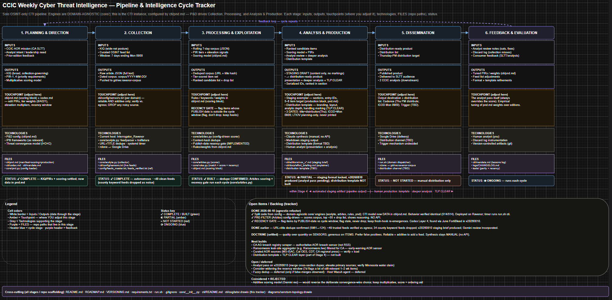
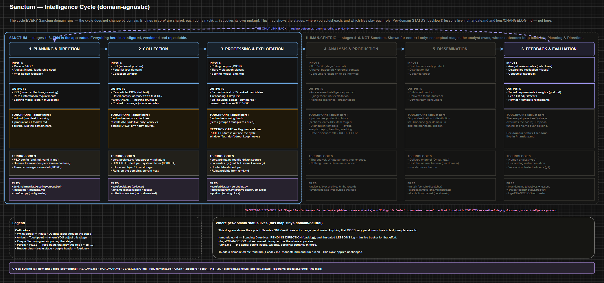

<p align="center">
  
</p>

<h1 align="center">Sanctum</h1>

<p align="center"><em>"Restraint is the product."</em></p>

**Sanctum — the seat of detection.** A domain-agnostic, open-source-intelligence (OSINT) apparatus: you set the **Planning & Direction** for a domain, and Sanctum collects against it, scores what it finds, and refines the result into a **vox** — a review surface an analyst can actually work from. The intelligence cycle is the same whatever the domain; only the requirements and sensors change.

Sanctum is themed after the Imperium's Inquisition — an **Acolyte** that gathers, an **Arbites** that judges, a **Lexicanum** that remembers, a **Codex** of doctrine, a **Cogitator** that maps the cycle, and the **Vox** in which the week's findings are set down. The theme is flavour; the machinery underneath is a plain, auditable pipeline.

All work is **unclassified / OSINT**. The finished product is **TLP:CLEAR** (freely shareable).

## What it does

You configure a domain once (its mission, requirements, sensors, and scoring), then run one command. Sanctum:

1. **Collects** (stage 2) from the sensors you list, extracts full text, deduplicates, and stores a dated corpus that is never pruned.
2. **Processes** (stage 3a) the corpus against your requirements — a transparent, multiplicative scoring model — producing the **staging document**: ~55 ranked candidates, each showing its reasoning, plus a full drop list. This part is deterministic Python.
3. **Exploits** (stage 3b) that queue into the **vox** — selected, summarised, caveated, sectioned. This part needs language, so it is an operator with a model, following the twelve rules in [`EXPLOITATION.md`](EXPLOITATION.md).

**Sanctum is stages 1–3 and its output is the vox** — a refined staging document, not an intelligence product. Analysis, dissemination and feedback are the analyst's and sit outside the apparatus.

A human decides every item. Nothing in `core/` calls a model, spends a token, or reaches a network service it wasn't pointed at.

## Two efforts (example domains)

- **Effort 1 — CTI (operational).** A weekly OSINT cyber-threat-intelligence cycle for low-maturity **State/Local/Tribal/Territorial (SLTT)** partners, tuned for a regional Area of Responsibility. Produces a weekly **TLP:CLEAR** brief. See `cti/`.
- **Effort 2 — a second domain.** A second effort needs only its own `pnd.md`; nothing in `core/` changes. Domains live in the repo, so a clone gives you worked examples rather than an empty engine. A domain that must stay private can live anywhere on disk instead and be passed with `--pnd`.

The point of Sanctum is that both run on the **same engine** — only their `pnd.md` differs.

## Naming scheme (Inquisition / Ordo theme)

| Name | Role | Type |
|------|------|------|
| **Sanctum** | The apparatus — the seat of detection | Project |
| **Acolyte** (`acolyte.py`) | Collector — gathers signal from the sensors | Engine |
| **Arbites** (`arbites.py`) | Pre-filter / scorer — provisional judgment on items | Engine |
| **Lexicanum** (`lexicanum.py`) | Archivist — searches everything ever collected, and counts matches over time | Engine |
| **Codex** | Intelligence requirements & doctrine (KIQ / PIRs / scoring) | Doc |
| **Vox** | The weekly output — a refined staging document, not an intelligence product | Product |
| **Cogitator** | The intelligence-cycle map (process + roles) | Diagram |

## Architecture



```
   stage 2          stage 3a                stage 3b              out of scope
[ Acolyte ]  -->  [ Arbites ]      -->   [ operator + LLM ]  -->   [ analyst ]
 collect           score & rank            select · summarise       assess ·
 extract           ~55 candidates          caveat · section         disseminate
 dedupe            + drop list                                      feed back
      |                  |                        |
      v                  v                        v
   corpus/         STAGING DOCUMENT              VOX
  permanent         (machine-made,          (judgement applied,
                     reproducible)           committed to editions/)

 [ Lexicanum ]  archive search + match-frequency as a rate
                asked on demand, outside the weekly cycle, changes nothing
```

Both the corpus and the dated staging document are pushed to the corpus store, so
the operator picks the staging document up on their own machine rather than on the
collector.

The intelligence cycle in full, and which stages are Sanctum's:



Stages 1–3 are the apparatus. Stages 4–6 are drawn greyed because they belong to
the analyst — their outcomes return to Sanctum only as edits to `pnd.md`.

Governed by the **Codex**. Mapped by the **Cogitator**. Everything domain-specific lives in a domain's **Planning & Direction** file (`<domain>/pnd.md`); the engines hold no domain knowledge.

## Doctrine

Eleven tenets govern every decision in this build. The first five are how it is engineered; the rest are how it is operated.

1. **Simplicity & elegance.** Minimal, legible structure — one file per domain's P&D, references separated from production, no cruft. If it can be simpler, make it simpler.
2. **Domain-agnostic engine.** `core/` holds zero domain knowledge. The intelligence cycle never changes by domain. Standing up a new domain is dropping in one domain file — and the engine performs the same on it as on any other.
3. **Domain files declare, they never behave.** A domain file holds settings and the explanation of those settings. Nothing else — no logic, no conditions, no scoring behavior. The moment a domain file can *act*, the engine has quietly stopped being shared. Enforced by `tests/domain_check.py`, not by discipline.
4. **Planning & Direction is the single control surface.** Set the domain there; it drives Collection, Processing & Exploitation, and Analysis & Production. One place to configure.
5. **Portable & decoupled.** Git is the source of truth; the repo is standalone; the host and corpus store are configuration, not code. It moves anywhere via env/manifest — no code changes.
6. **Restraint is the product.** The vox is a deliberately generous review surface; whatever the analyst distributes afterward narrows hard. Quality over quantity on sensors, generous on items. Coverage emerges from good sensors well-operated, not from piling on feeds.
7. **The human gate is absolute.** The score orders the queue; the analyst always decides and overrides. Stage 3b uses a language model because it needs language — but a person decides every item, and **nothing in `core/` ever calls a model or spends a token**. Sanctum ships the method; the operator brings the tool.
8. **Transparent and fail-safe.** Every surfaced item shows its scoring reasoning; nothing is hidden (mandatory drop list). Prefer false positives to false negatives — flag, don't drop. Exclusion (`not`) is the one narrowing tool and it still drops nothing: it withholds a tier or a multiplier, so an excluded item is scored lower but remains collected, listed, and shown with its reasoning.
9. **Stops at the vox.** Sanctum collects, processes and exploits; it does not assess. The vox is a refined staging document — a review surface, not an intelligence product. What the vox *means* is the analyst's judgement, and that diverges hardest by domain.
10. **Prove before you build.** Don't over-engineer; don't abstract before a second real use case exists; scale or migrate only after it earns it. Favor near-zero technical debt.
11. **Scrubbed, secure, verified.** Secrets never enter the repo; the public face carries no identifying or infra detail. Verify, don't guess — behavior-changing edits are proven by tests.

Scoring is convergence-based and multiplicative (tier weights 8/4/2/1 × elevation multipliers) by design: a heavily-elevated lower-tier item can outrank a bare higher-tier one.

## Cadence

The weekly cycle runs on a fixed schedule (see `cti/mandate.md` for the authoritative version):

- **Collector runs — 0500 Pacific, daily.** Pinned to `America/Los_Angeles`, so it does not drift at daylight saving.
- **Collection cutoff / ICOD — Monday 0500**, matching the moment collection completes.
- **Staging document ready — Monday 0500.** Pushed to the corpus store, dated.
- **Vox produced and shared — Monday morning.** Stage 3b. Sanctum's job ends here.
- **Team review — Monday to Wednesday.** Outside the apparatus; its outcome returns as edits to `pnd.md`.

Three dates on the product: the **title** carries the distribution date; the body carries an **"information current as of" (ICOD)** line = the collection cutoff; **LTIOV** stays in planning doctrine only and never appears on the product.

## Stack

Python (feedparser, trafilatura, rclone), systemd timer, a corpus store (any rclone-supported backend), draw.io diagrams. The collector runs on a dedicated, isolated, outbound-only host; nothing needs to reach back into it. Where it runs is configuration, not code — see Portability below.

## Running it (domain-agnostic)

The `core/` engines hold **no domain knowledge**. Everything specific to an effort — the feed list, the scoring model, the output shape, where the corpus lives — comes from that domain's **Planning & Direction** file, `<domain>/pnd.md` (a markdown doc whose config lives in fenced `yaml`/`sensors` blocks).

```
./run.sh cti          # collect + score the CTI domain
./run.sh <domain>     # same engines, any domain with its own pnd.md
```

**Searching the archive.** The weekly cycle looks at a window; Lexicanum looks
at everything ever collected.

```
core/lexicanum.py cti --group ransom --by week      # where has this appeared, and when
core/lexicanum.py cti --all-groups --counts --by month
core/lexicanum.py cti --term "emotet"               # an ad-hoc term, not in the domain file
core/lexicanum.py --pnd /path/to/pnd.md --group platform --since 2026-01-01
```

Matches are **recomputed on demand**, not stored at collection time. That is
deliberate: a stored index can only answer questions you thought to ask on
collection day, whereas re-running the live matcher lets a group invented this
morning be run against everything collected last year. It also guarantees
results agree with the scorer — same matcher, no second implementation to drift.

Counts are bucketed by **collection date**, because publication dates are
missing or malformed often enough that the scorer carries a recency gate to cope
with it. `--by-published` switches axis where you accept the gaps.

**Read the rate, not the count.** Every table shows hits, the articles collected
in that period, and the resulting rate — because a period where you collected
less looks exactly like a period where less happened. On the first real run,
ransomware hits fell 475 → 122 and read as a collapse; the denominators showed
6,585 articles versus 1,370, and the rate had *risen*.

**Portability:** the only host-coupled value is `base_dir` in each `pnd.md` manifest — override it per host with the `SANCTUM_BASE` env var. To stand Sanctum up elsewhere: clone, `pip install -r requirements.txt`, point the manifest at your corpus store, and run. No code changes.

**To add a domain:** drop in `<newdomain>/pnd.md` (+ `codex.md`, `mandate.md`) and run `./run.sh <newdomain>`. The cycle applies unchanged.

## Version control & sync

**Git is the source of truth** (see `VERSIONING.md`). The remote is authoritative. The authoring workstation pushes; **the collector host only ever pulls** — nothing it produces is tracked, and read-only means a compromise there cannot rewrite the source of truth.

Each domain's `editions/` folder holds its published voxes. They are committed because judgement was applied and nothing can regenerate them. The staging document is *not* committed — it is machine-made and reproducible from the corpus plus the config, both of which are kept.

Secrets **never** enter the repo — the `.gitignore` blocks credential carriers (`rclone.conf`, tokens, service-account JSON, `.env`) and runtime data (`corpus/`, `seen.txt`, `seen_titles.txt`). Public feed URLs are safe to commit.

## Repo layout

```
sanctum/
├── README.md
├── ROADMAP.md               # vision, keeper test, future production node
├── EXPLOITATION.md          # stage 3b — how a staging document becomes a vox
├── VERSIONING.md            # git-as-truth; artifact version anchors
├── requirements.txt         # python deps (feedparser, trafilatura, pyyaml)
├── run.sh                   # run.sh <domain>  — collect + score one domain
├── .gitignore
├── core/                    # DOMAIN-AGNOSTIC engines (the only code)
│   ├── pnd.py               # loads a domain's P&D config (yaml-in-markdown)
│   ├── rules.py             # matcher + scorer + recency gate (+ the `not` operator)
│   ├── acolyte.py           # collector engine
│   ├── arbites.py           # pre-filter / scorer engine
│   └── lexicanum.py         # archive search + match-frequency over time
├── cti/                     # Effort 1 — SLTT CTI (example domain) — CONFIG + outputs
│   ├── pnd.md               # THE P&D file: manifest + sensors + scoring + production
│   ├── codex.md             # intelligence requirements & doctrine (prose)
│   ├── mandate.md           # standing planning & direction record (+ status/backlog)
│   ├── README.md            # effort overview
│   └── editions/            # brief editions
│                            # (references/ kept local, git-ignored)
├── diagrams/                # domain-neutral diagrams — .drawio is the source,
│   ├── cogitator.drawio     #   .png is the viewable copy for GitHub
│   ├── cogitator.png
│   ├── sanctum-topology.drawio
│   └── sanctum-topology.png
├── logs/
│   └── CHANGELOG.md
└── tests/                   # engine tests + the commit gate
    ├── pre_commit.sh        # THE COMMIT GATE — runs both guards below
    ├── scrub_check.sh       # tenet 11 — nothing identifying reaches the public repo
    ├── domain_check.py      # tenet 3  — no domain file contains behavior
    ├── domain_check_test.py
    ├── upgrades_test.py     # exclusion operator + archive search
    ├── grouping_test.py
    ├── diff_scores.py
    ├── recency_test.py
    └── old_arbites.py
```

**Install the commit gate (once per clone):**

```
git config core.hooksPath .githooks
mkdir -p .githooks && ln -sf ../tests/pre_commit.sh .githooks/pre-commit
cp .scrub-denylist.example .scrub-denylist   # then edit it
```

## Diagrams

`.drawio` is the source of truth; the `.png` beside it is what GitHub renders.
To update one: edit the `.drawio`, then **File → Export as → PNG** with
*Include a copy of my diagram* ticked, saving over the existing `.png`. That
export embeds the diagram in the image, so the PNG can be dragged back into
draw.io and edited too — and it beats a screenshot on bounds, resolution and
repeatability. Commit both files together.

## License / use

Personal open-source project. The doctrine and code are shared freely; adapt the `pnd.md` for your own domain and AOR.
