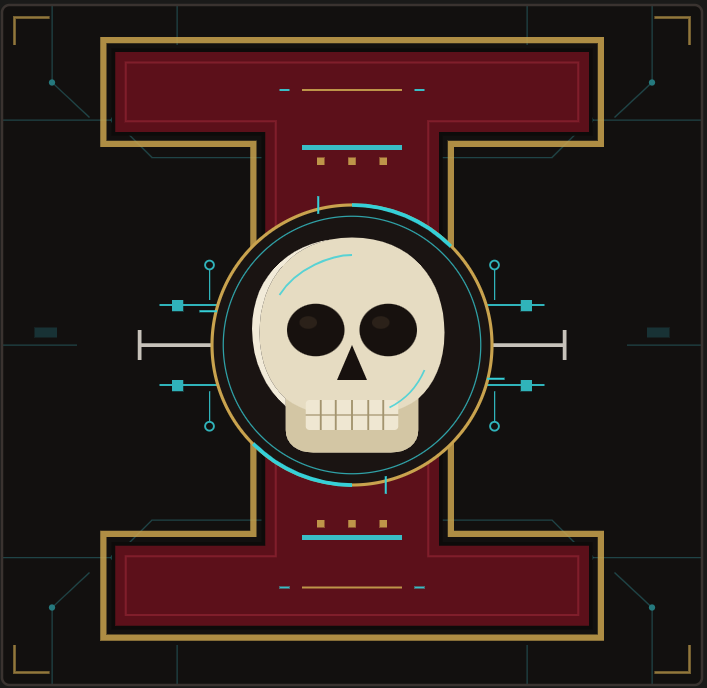

<p align="center">
  
</p>

<h1 align="center">Sanctum</h1>

<p align="center"><em>"Restraint is the product."</em></p>

**Sanctum — the seat of detection.** A domain-agnostic, open-source-intelligence (OSINT) apparatus: you set the **Planning & Direction** for a domain, and Sanctum goes out and collects, triages against that direction, and stages the results for a human analyst to review. The intelligence cycle is the same whatever the domain; only the requirements and sensors change.

Sanctum is themed after the Imperium's Inquisition — its working parts are an **Acolyte** that gathers, an **Arbites** that judges, a **Codex** of doctrine, a **Cogitator** that maps the cycle, and the **Vox** by which the finished word goes out. The theme is flavor; the machinery underneath is a plain, auditable pipeline.

All work is **unclassified / OSINT**. The finished product is **TLP:CLEAR** (freely shareable).

## What it does

You configure a domain once (its mission, requirements, sensors, and scoring), then run one command. Sanctum:

1. **Collects** from the sensors you list (RSS/Atom feeds and pages), extracts full text, deduplicates, and stores a dated corpus.
2. **Triages** the corpus against your requirements — a transparent, multiplicative scoring model — and produces a ranked candidate shortlist plus a full drop list.
3. **Stages** the result as a content-only draft for a human analyst to verify, cut, and finish.

A human always reviews before anything is published. The score orders the queue; the analyst decides. Synthesis is deliberately **manual** — no API, no tokens.

## Two efforts (example domains)

- **Effort 1 — CTI (operational).** A weekly OSINT cyber-threat-intelligence cycle for low-maturity **State/Local/Tribal/Territorial (SLTT)** partners, tuned for a regional Area of Responsibility. Produces a weekly **TLP:CLEAR** brief. See `cti/`.
- **Effort 2 — S2 (future stub).** A weekly cycle for [REDACTED] role, sharing the same machinery but its own doctrine (IPB frameworks: MCOO, OAKOC, METT-TC, ASCOPE, PMESII-PT). See `s2/`.

The point of Sanctum is that both run on the **same engine** — only their `pnd.md` differs.

## Naming scheme (Inquisition / Ordo theme)

| Name | Role | Type |
|------|------|------|
| **Sanctum** | The apparatus — the seat of detection | Project |
| **Acolyte** (`acolyte.py`) | Collector — gathers signal from the sensors | Engine |
| **Arbites** (`arbites.py`) | Pre-filter / scorer — provisional judgment on items | Engine |
| **Codex** | Intelligence requirements & doctrine (KIQ / PIRs / scoring) | Doc |
| **Vox** | The brief itself — the product disseminated | Product |
| **Cogitator** | The intelligence-cycle map (process + roles) | Diagram |

## Architecture

```
[ Acolyte ]            [ Arbites ]              [ Human Gate ]          [ Vox ]
 collector      -->     pre-filter/scorer  -->   analyst review   -->   published brief
 (autonomous,           (scores corpus,          (verify, merge,        (TLP:CLEAR,
  daily)                 surfaces top ~55,         cut to 5-8,            weekly)
      |                  + drop list)              override scores)
      v
 Corpus store (the handoff surface between collection and analysis)
```

Governed by the **Codex**. Mapped by the **Cogitator**. Everything domain-specific lives in a domain's **Planning & Direction** file (`<domain>/pnd.md`); the engines hold no domain knowledge.

## Doctrine

Eleven tenets govern every decision in this build. The first five are how it is engineered; the rest are how it is operated.

1. **Simplicity & elegance.** Minimal, legible structure — one file per domain's P&D, references separated from production, no cruft. If it can be simpler, make it simpler.
2. **Domain-agnostic engine.** `core/` holds zero domain knowledge. The intelligence cycle never changes by domain — only the config does. Standing up a new domain is dropping in one `pnd.md`.
3. **Config over code.** Steer by editing `pnd.md` (feeds, weights, rules, output shape), never by editing Python. Requirements, scoring, and sensors are data, not logic.
4. **Planning & Direction is the single control surface.** Set the domain there; it drives Collection, Processing & Exploitation, and Analysis & Production. One place to configure.
5. **Portable & decoupled.** Git is the source of truth; the repo is standalone; the host and corpus store are configuration, not code. It moves anywhere via env/manifest — no code changes.
6. **Restraint is the product.** 5–8 items in the *distributed* report; the Monday staging draft is a deliberately larger review surface that narrows through the week. Quality over quantity on sensors, generous on items. Coverage emerges from good sensors well-operated, not from piling on feeds.
7. **The human gate is absolute.** The score orders the queue; the analyst always decides and overrides. Synthesis stays manual (no API/tokens) by deliberate choice.
8. **Transparent and fail-safe.** Every surfaced item shows its scoring reasoning; nothing is hidden (mandatory drop list). Prefer false positives to false negatives — flag, don't drop.
9. **Stops at the staging document.** Sanctum triages and stages; it does not build the finished product. That final step diverges hardest by domain and stays a human job.
10. **Prove before you build.** Don't over-engineer; don't abstract before a second real use case exists; scale or migrate only after it earns it. Favor near-zero technical debt.
11. **Scrubbed, secure, verified.** Secrets never enter the repo; the public face carries no identifying or infra detail. Verify, don't guess — behavior-changing edits are proven by tests.

Scoring is convergence-based and multiplicative (tier weights 8/4/2/1 × elevation multipliers) by design: a heavily-elevated lower-tier item can outrank a bare higher-tier one.

## Cadence

The weekly cycle runs on a fixed schedule (see `cti/mandate.md` for the authoritative version):

- **Collection cutoff / ICOD — Monday 0900.** Corpus is windowed on the 7 days ending Monday 0900.
- **Staging draft ready — Monday.**
- **Individual review / amend — Monday–Tuesday.**
- **Team review — Wednesday.**
- **Distribution — Thursday afternoon.**

Three dates on the product: the **title** carries the distribution date; the body carries an **"information current as of" (ICOD)** line = the collection cutoff; **LTIOV** stays in planning doctrine only and never appears on the product.

## Stack

Python (feedparser, trafilatura, rclone), systemd timer, a corpus store (any rclone-supported backend), draw.io diagrams. The collector runs on a dedicated, isolated, outbound-only host; nothing needs to reach back into it. Where it runs is configuration, not code — see Portability below.

## Running it (domain-agnostic)

The `core/` engines hold **no domain knowledge**. Everything specific to an effort — the feed list, the scoring model, the output shape, where the corpus lives — comes from that domain's **Planning & Direction** file, `<domain>/pnd.md` (a markdown doc whose config lives in fenced `yaml`/`sensors` blocks).

```
./run.sh cti          # collect + score the CTI domain
./run.sh s2           # same engines, once s2/pnd.md is filled in
```

**Portability:** the only host-coupled value is `base_dir` in each `pnd.md` manifest — override it per host with the `SANCTUM_BASE` env var. To stand Sanctum up elsewhere: clone, `pip install -r requirements.txt`, point the manifest at your corpus store, and run. No code changes.

**To add a domain:** drop in `<newdomain>/pnd.md` (+ `codex.md`, `mandate.md`) and run `./run.sh <newdomain>`. The cycle applies unchanged.

## Version control & sync

**Git is the source of truth** (see `VERSIONING.md`). A private remote is authoritative; the collector host and an authoring workstation are working copies that push/pull against it, so history survives any host rebuild.

Secrets **never** enter the repo — the `.gitignore` blocks credential carriers (`rclone.conf`, tokens, service-account JSON, `.env`) and runtime data (`corpus/`, `seen.txt`, `seen_titles.txt`). Public feed URLs are safe to commit.

## Repo layout

```
sanctum/
├── README.md
├── ROADMAP.md               # vision, keeper test, future production node
├── VERSIONING.md            # git-as-truth; artifact version anchors
├── requirements.txt         # python deps (feedparser, trafilatura, pyyaml)
├── run.sh                   # run.sh <domain>  — collect + score one domain
├── .gitignore
├── core/                    # DOMAIN-AGNOSTIC engines (the only code)
│   ├── pnd.py               # loads a domain's P&D config (yaml-in-markdown)
│   ├── rules.py             # matcher + scorer + recency gate
│   ├── acolyte.py           # collector engine
│   └── arbites.py           # pre-filter / scorer engine
├── cti/                     # Effort 1 — SLTT CTI (example domain) — CONFIG + outputs
│   ├── pnd.md               # THE P&D file: manifest + sensors + scoring + production
│   ├── codex.md             # intelligence requirements & doctrine (prose)
│   ├── mandate.md           # standing planning & direction record (+ status/backlog)
│   ├── README.md            # effort overview
│   └── editions/            # brief editions
│                            # (references/ kept local, git-ignored)
├── s2/                      # Effort 2 — Aviation S2 — CONFIG (stub)
│   ├── pnd.md
│   └── README.md
├── diagrams/                # domain-neutral diagrams
│   ├── cogitator.drawio     # the intelligence-cycle map (shared by all domains)
│   └── sanctum-topology.drawio
├── logs/
│   └── CHANGELOG.md
└── tests/                   # parity + recency tests for the engine
    ├── diff_scores.py
    ├── recency_test.py
    └── old_arbites.py
```

## License / use

Personal open-source project. The doctrine and code are shared freely; adapt the `pnd.md` for your own domain and AOR.
